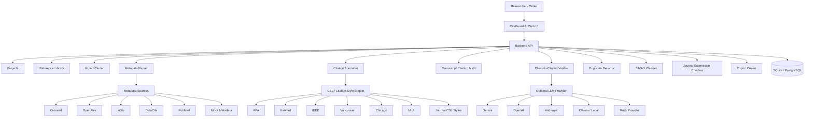
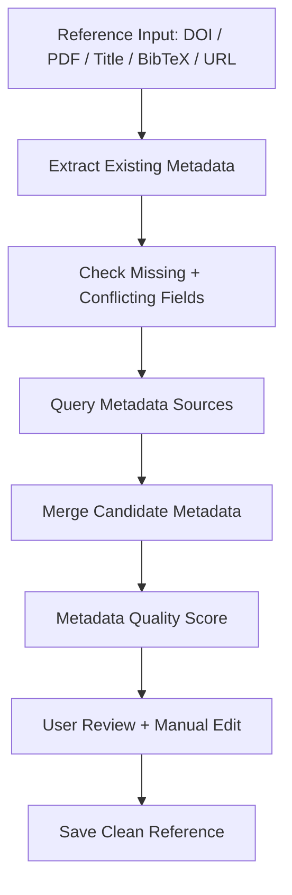
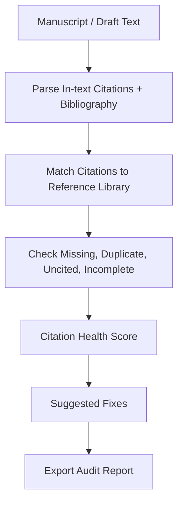
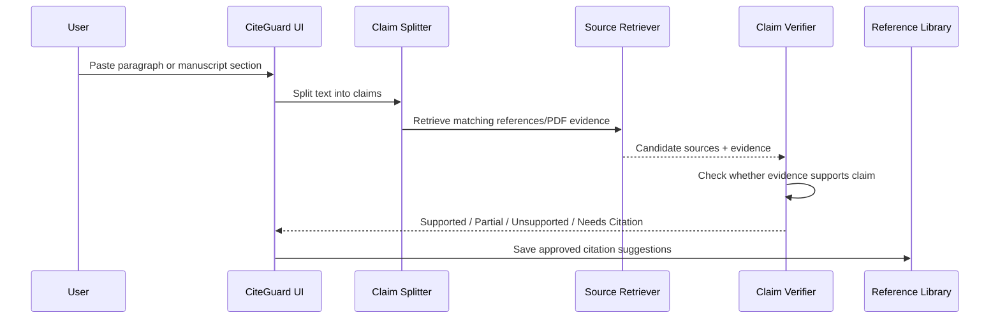
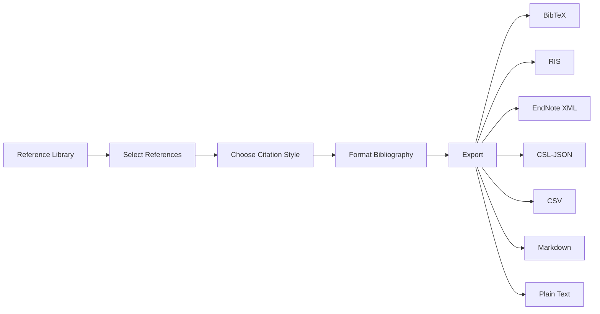

# CiteGuard AI — Reference Quality Control & Citation Intelligence Platform

**CiteGuard AI** is an AI-powered citation intelligence and quality-control platform built for academic researchers, PhD scholars, professors, medical writers, and technical publication teams. 

CiteGuard AI acts as a **scholarly quality-control system** for manuscripts. It automates citation metadata repair, audits draft manuscripts to find citation-bibliography discrepancies, cleans BibTeX databases, checks duplicate reference groups, and performs semantic claim-to-citation verification.

---

## The Problem and Market Gap

Existing citation tools (Zotero, Mendeley, EndNote) store references and output bibliographies, but academic writers still struggle with:
1. **Wrong or Incomplete PDF Metadata**: Missing DOIs, journals, issue numbers, or pages.
2. **Fake AI-Generated Citations**: Non-existent or hallucinated sources produced by LLM drafting tools.
3. **Citation-to-Claim Mismatch**: References cited in text that do not actually support the written scientific claim.
4. **Discrepancy Inconsistencies**: In-text brackets cited in drafts but missing from the reference list, or vice versa.
5. **Brace-wrapping and casing errors**: LaTeX BibTeX keys requiring manual brackets formatting.

CiteGuard AI closes these gaps by auditing manuscripts before submission, protecting researchers against publication rejection and formatting failures.

---

## Key Features

- **Citation Dashboard**: Displays reference metrics, incomplete fields, and a global citation health score.
- **Reference Library**: Standardized local-first database library for managing project references.
- **Metadata Repair Center**: Audits and queries Crossref, OpenAlex, and arXiv registries side-by-side to fill in missing fields.
- **Manuscript Citation Audit**: Parses bracketed references in draft text to check for missing items, mixed styles, or incorrect ordering.
- **Claim-to-Citation Verifier**: Splits paragraphs into atomic sentences, verifies reference text, and checks if citations support claims.
- **Citation Suggestion Tool**: Identifies uncited claims and recommends relevant bibliography sources.
- **Duplicate Detector**: Scans fuzzy title similarity and DOIs to merge redundant items.
- **BibTeX Cleaner**: Formats bracket braces and checks mismatched syntax.
- **Journal Checker**: Audits compliance against publisher-specific guidelines.
- **Multi-Format Exports**: Downloads databases in BibTeX, RIS, EndNote XML, CSV, CSL-JSON, HTML, and Markdown.

---

## System Architecture



---

## Core Workflows

### 1. Reference Metadata Repair Workflow



### 2. Manuscript Citation Audit Workflow



### 3. Claim-to-Citation Verification Sequence



### 4. Reference Export Workflow



---

## Folder Structure

```text
citeguard-ai/
├── app/
│   ├── database/
│   │   ├── db.py                 # SQLite database CRUD operations
│   │   └── schema.sql             # SQL database table entities definitions
│   ├── security/
│   │   └── validation.py         # Key redacting and file validators
│   └── static/                   # SPA Client frontend assets
│       ├── index.html            # Main HTML Shell
│       ├── css/
│       │   └── style.css         # Glassmorphism dark styles variables
│       └── js/
│           ├── app.js            # Global Router state store
│           └── pages/            # View components (dashboard, verifier, duplicates...)
├── citation/                     # Reference Core Algorithms
│   ├── bibtex_cleaner.py         # BibTeX normalizing and acronym brace wrapping
│   ├── bibtex_parser.py          # BibTeX string parser
│   ├── citation_auditor.py       # Manuscript draft citations checking
│   ├── citation_formatter.py     # APA, IEEE CSL formats rendering
│   ├── citation_suggester.py     # Keyword mapping for claims
│   ├── claim_citation_verifier.py# LLM and Mock verifications
│   ├── claim_splitter.py         # Sentences boundary parsing
│   ├── duplicate_detector.py     # Jaccard title token checking
│   ├── export_service.py         # RIS, XML, BibTeX export compilers
│   ├── journal_checker.py        # Publisher submission requirements checklist
│   ├── metadata_extractor.py     # PDF text read using pypdf
│   └── ris_parser.py             # RIS tag files loader
├── docs/                         # Additional documentation details
├── examples/
│   └── seed_data.py              # CLI seed dataset injector
├── tests/
│   └── test_citation_engine.py   # Unit testing suite
├── .env.example                  # Environment configuration template
├── .gitignore
├── app.py                        # FastAPI web server entrypoint
├── Dockerfile                    # Docker build configuration
├── docker-compose.yml            # Local hosting deployment compose file
└── requirements.txt              # Project package requirements
```

---

## Installation and Quick Start

### 1. Local Python Setup

Clone the repository and install requirements:
```bash
git clone [REPO_URL]
cd CiteGuard-AI
cp .env.example .env
# Keep MOCK_MODE=true for local-first zero API key demo mode
pip install -r requirements.txt
python app.py
```
Open `http://localhost:8000` in your web browser.

### 2. Docker Containers Setup

```bash
docker compose up --build
```
The database and upload directories are mounted automatically as local volumes.

### 3. Verification and Testing

Execute the full unit test suite using `pytest`:
```bash
pytest tests/
```

---

## Configuration & Environment Variables

Create a `.env` file at the root. Standard parameters:

| Variable | Default | Description |
| --- | --- | --- |
| `MOCK_MODE` | `true` | When `true`, works offline without public API keys / LLM providers. |
| `LLM_PROVIDER` | `mock` | Select active model client: `gemini`, `openai`, `anthropic`, `groq`, `mistral`, `ollama`. |
| `DATABASE_URL` | `sqlite:///citeguard.db` | Local sqlite database storage path. |
| `GEMINI_API_KEY` | (empty) | API key for Google Gemini provider. |
| `OPENAI_API_KEY` | (empty) | API key for OpenAI GPT models. |
| `CROSSREF_MAILTO` | (empty) | Email header used to prioritize Crossref queries. |

---

## Security and Privacy Model

- **Local-First Storage**: All projects, references, PDF text extracts, and notes are cached locally in the SQLite database (`citeguard.db`).
- **Secret Redaction**: API keys and tokens are masked securely inside system logs and UI settings panels.
- **Privacy Warnings**: In non-mock mode, CiteGuard warns users when submitting draft paragraphs or PDF text contents to cloud AI models. Use **Ollama** for completely offline, local AI operations.

---

## License

Licensed under the MIT License.
